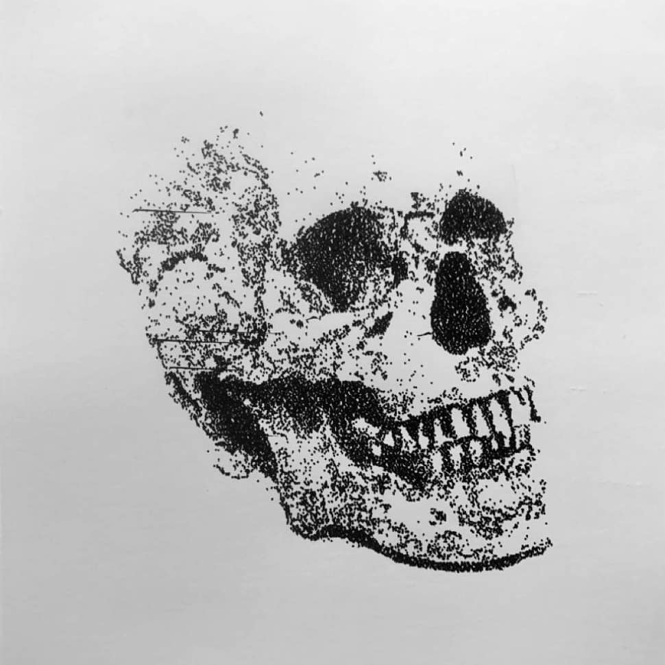
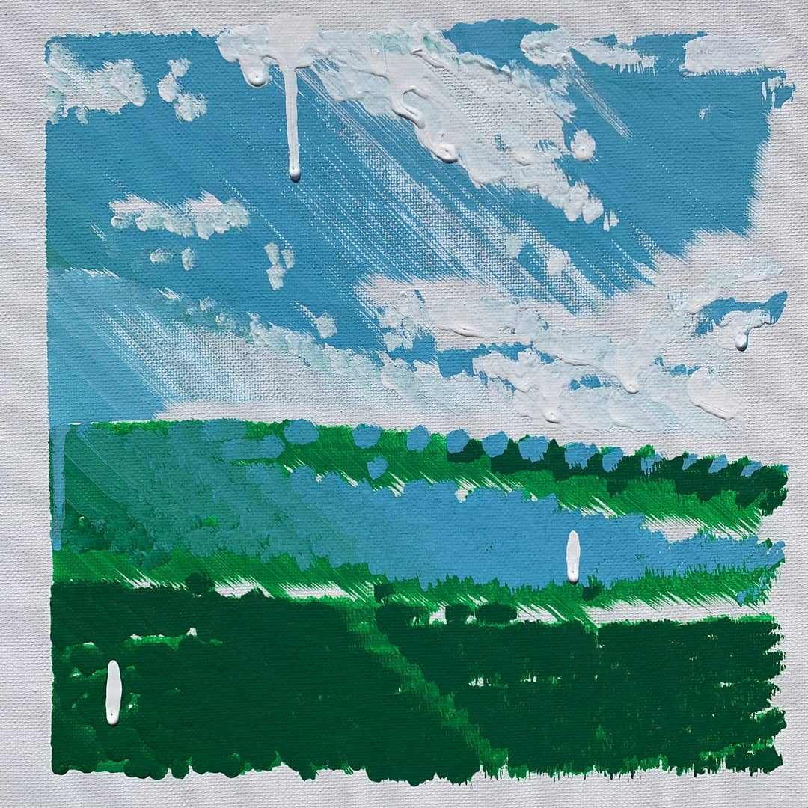
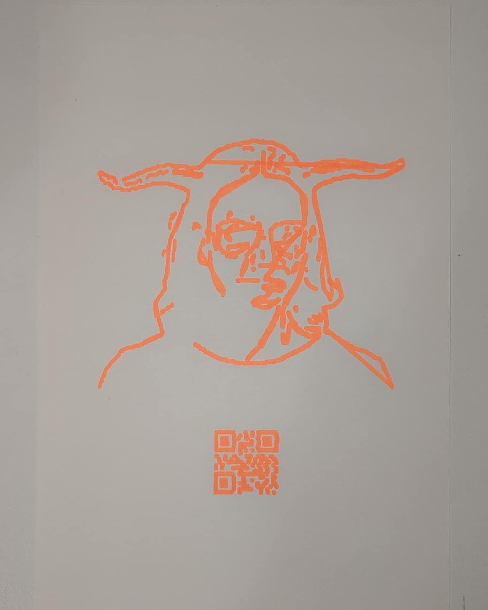
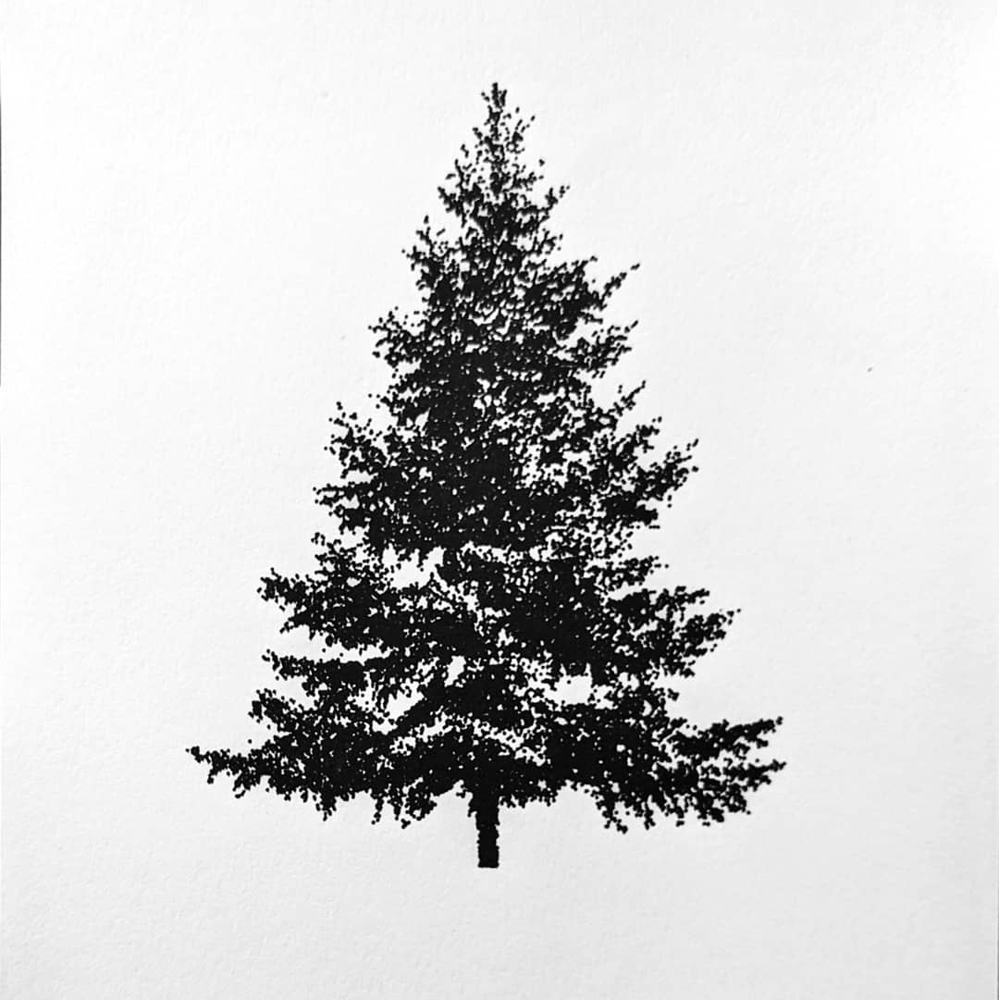

# uArt API

This is an API for making artwork with a uArm Swift Pro robot arm.

Built using the uArm python SDK

# Examples

The best way to learn how to make artwork is by looking at some of the example 
code you can find in the `examples/`

# How to configure an arm

You will need to reconfigure the default coordinates for the robot arm 
found in the `__init__` function of the `uart` class to match the coordinates
of the **TIP** of your drawing utensil.

`tl` = top left
`bl` = bottom left
`tr` = top left
`br` = bottom right

There is a manual configuration feature but it is not recommended as once configured, the points are not saved

# Other notes

The perspective transform is a work in progress, although you may be to get it 
to work if you dig through the code enough

# Examples of work created with uArt

Take a look at the Instagram account @bart.robot for more work.
